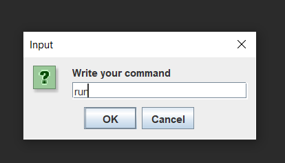
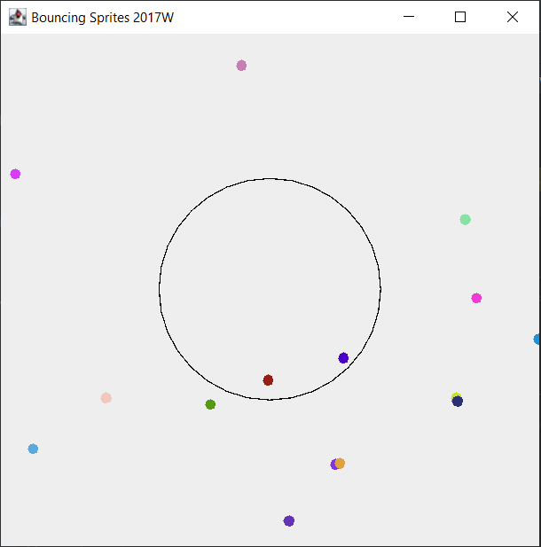
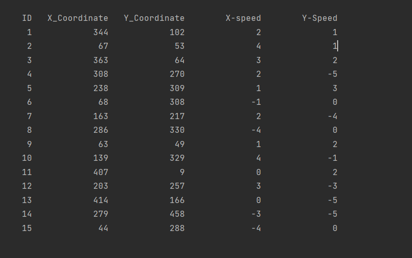

## BouncingSprities

---

### Table of Contents

- [Description](#description)
- [Installation](#installation)
- [ScreenShots](#screenshots)
- [References](#references)

---

## Description

This project implements a small game logic in which a ball is created each time someone clicks on the screen. Each ball will have different color, speed and different 
speed. Inside the screen there is a circle object which will captureballs. The Circle object can only hole two balls at a time, if a third ball enter inside the feild 
then it will realease the one of the two ball it has. Each ball creation is save in a database. 

#### Concepts

- Swing
- Multi-threading
- Server-Client application
- SQLite

[Back To The Top](#BouncingSprities)

---

## Installation
You can mostly run this application after downloading it from GitHub. Just make usre that your have imported SQLite jar which I have provided inside the project folder.
First Run Server class then Client Class which will then prompt you to enter a command to start the application and the command to start it is "run". 

---

## ScreenShots

Input Dilog box

Panel for Displaying the program logic.

Database table which record each ball and it's data. On the start of the program it will clear itself so that it can store new ball's data.

## References
https://www.youtube.com/watch?v=gchR3DpY-8Q

https://www.youtube.com/watch?v=r_MbozD32eo

https://www.youtube.com/watch?v=Kmgo00avvEw

[Back To The Top](#BouncingSprities)
